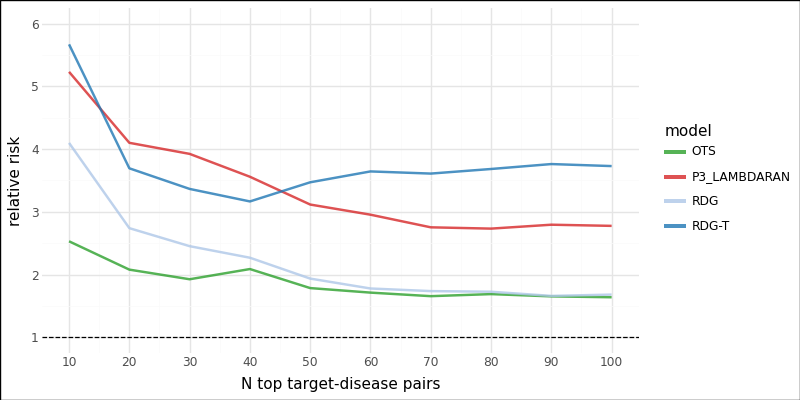
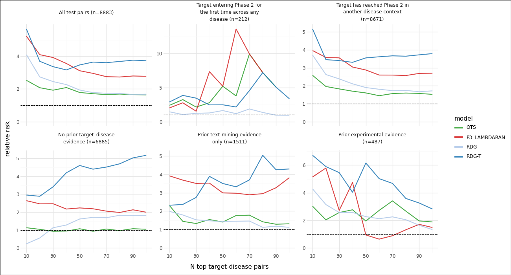
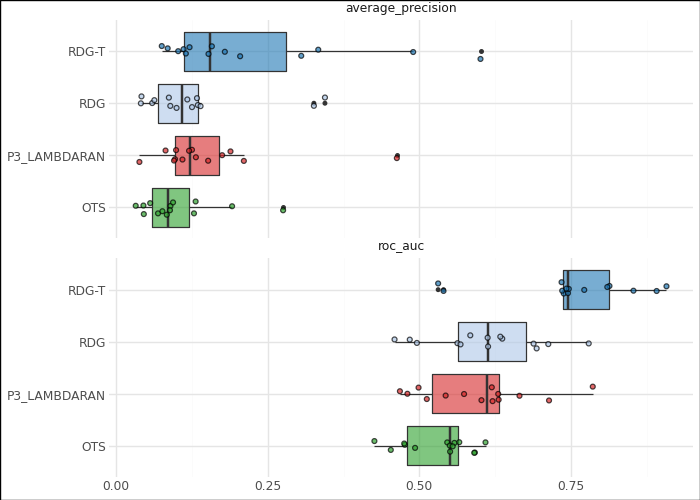
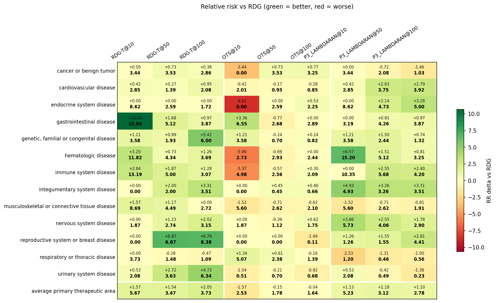
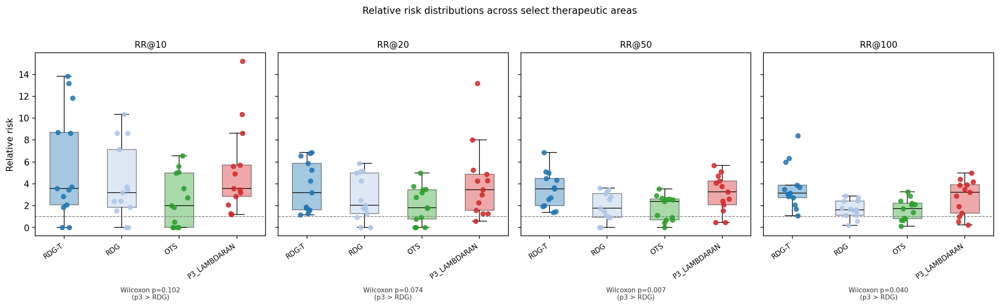

# Advancement Prediction — Benchmark Results

Benchmark of scoring methods on the clinical-advancement prediction task, evaluated on held-out test pairs. The headline comparison is **P3_LAMBDARAN (proposed)** vs. **RDG (time-agnostic baseline)**. OTS is included as an association-score baseline.

> **Note on RDG-T.** RDG-T (`rdg__all__positive`) is RDG fit with all features including `target_disease__time__transition` — the time since a target–disease pair first entered Phase 2 trials. This feature directly encodes the label, so RDG-T leaks future information and its apparent lead is not a fair comparison. The discussion below focuses on RDG vs. P3_LAMBDARAN.
>
> Czech et al. (2024) on RDG-T:
> *"The third ranking method presented in Figure 2, 'RDG-T', differs from the RDG model only in that it uses time since the phase 2 transition as a predictive factor in addition to all others. We observe that the use of this information greatly improves standard performance metrics like receiver operating characteristic (ROC) and average precision (AP), however it adds little to no value in rankings beyond a level where substantial relative risk increases can be observed. In other words, it constitutes an effective but coarse mechanism for ranking TD pairs while lacking the high precision of other factors like genetic support. […] we refrain from focusing on RDG-T, or the similar GBM-T model, because neither is readily applicable to undeveloped TD pairs for which the time since phase 2 transition is not available. They do, however, present a useful performance ceiling towards which future work might build."*
> — Czech et al., medRxiv 2024 (doi: 10.1101/2024.08.02.24311422)

## Models compared

| Slug | Description |
| --- | --- |
| `OTS` | OpenTargets global association score (`ots__all`). Association baseline. |
| `RDG` | Constrained, L2-regularized linear regressor (Ridge regressor) fit with all core features — all features except time since Phase 2 transition (`rdg__no_time__positive`). **Primary reference.** |
| `P3_LAMBDARAN` | Proposed EA-HGT trained with LambdaRank loss (`p3_lambdarank`). **Proposed model.** |
| ~~`RDG-T`~~ | RDG with all features including `target_disease__time__transition` (time since Phase 2 entry for the T–D pair) — *excluded from conclusions* as this feature directly encodes the label. |

Strata:
- **Novelty**: `pioneer` (no prior T–D link) vs. `known`.
- **Evidence**: `direct_evidence`, `literature_only`, `evidence_free` at decision time.
- Combinations such as `known__literature_only` intersect the two axes.

## Overall classification performance

| Model | ROC-AUC | Average precision |
| --- | --- | --- |
| **P3_LAMBDARAN** | **≈0.63** | **≈0.12** |
| RDG | ≈0.64 | ≈0.11 |
| OTS | ≈0.49 | ≈0.09 |

P3_LAMBDARAN and RDG are roughly matched on global threshold-free metrics (P3 slightly higher AP, RDG slightly higher AUC). OTS performs at chance on this prospective split.

## Precision at top-N (relative risk vs. base rate)

**Relative risk at N (RR@N)** is the primary evaluation metric in Czech et al. It measures how much more frequently positive outcomes (Phase 2 → Phase 3 advancement) appear in the top-N ranked target–disease pairs compared to the base rate across all pairs:

$$\text{RR@N} = \frac{\text{positive rate among top-}N}{\text{positive rate among remaining pairs}}$$

A value of 1.0 means no enrichment; higher is better. This metric is preferred over AUC/AP for this task because it directly quantifies actionable prioritisation value — a model that concentrates true advancements at the top of the list is what matters for drug discovery triage, regardless of overall discrimination. Czech et al. report RR at N = 10, 20, 30, …, 100 (computed as a mean over primary therapeutic areas).

Comparing P3_LAMBDARAN to RDG across top-N cutoffs:

| N | RDG RR | **P3 RR** | Δ (P3 − RDG) |
| --- | --- | --- | --- |
| 10  | 4.10 | **5.23** | +1.13 |
| 20  | 2.73 | **4.10** | +1.37 |
| 30  | 2.45 | **3.92** | +1.47 |
| 40  | 2.27 | **3.56** | +1.29 |
| 50  | 1.93 | **3.12** | +1.19 |
| 60  | 1.78 | **2.95** | +1.17 |
| 70  | 1.74 | **2.75** | +1.01 |
| 80  | 1.73 | **2.73** | +1.00 |
| 90  | 1.68 | **2.79** | +1.11 |
| 100 | 1.68 | **2.78** | +1.10 |

**P3_LAMBDARAN beats RDG at every top-N cutoff**, typically by RR ≈ +1.0 to +1.5. The enrichment at the top of the ranking (the regime that matters for triage) is substantial: P3 delivers ~5× the base rate at N=10 vs. ~4× for RDG, and the advantage is preserved as N grows.

## Relative risk by stratum

P3 vs. RDG by stratum (ignoring RDG-T):
- **No prior target–disease evidence**: P3 dominates — RR@10 = 2.64 vs. 0.22 for RDG. RDG has almost no signal here while P3 does, likely because graph structure provides signal even without direct evidence links.
- **Prior text-mining evidence only**: P3 consistently 2–3× RDG across all cutoffs (RR@10 = 3.91 vs. 1.98; RR@90 = 3.27 vs. 1.18). The biggest sustained advantage.
- **Target entering Phase 2 for the first time across any disease**: Noisy due to small support (NaN at N=90 for P3). P3 shows strong enrichment at specific cutoffs (RR@60 = 13.60 vs. 1.17) but is unreliable at the extremes.
- **Target has reached Phase 2 in another disease context**: Both models perform well; P3 modestly ahead (RR@10 = 3.96 vs. 3.63, RR@90 = 2.69 vs. 1.67).
- **Prior experimental evidence**: Models are close at small N (RR@10 = 5.14 vs. 4.28) but P3 loses its edge at mid-range cutoffs (RR@60 = 0.64 vs. 2.12). Direct evidence is a strong enough signal that the graph adds little beyond what RDG captures.

## Per-therapeutic-area performance

The delta heatmap (P3 minus RDG) is the direct per-TA view of the proposed-vs-baseline question:

- At **N=10**, P3 beats RDG in nearly every TA. Largest gains: **hematologic disease** (+15.3), **immune system disease** (+10.4), **endocrine system disease** (+8.6), **gastrointestinal disease** (+3.2).
- At **N=100**, P3 still leads in most TAs (+1 to +5 RR) but the gap narrows and flips in a few (e.g. respiratory/urinary marginal).
- Wilcoxon signed-rank test of per-TA RR (P3 vs. RDG):
  - N=10: p = 0.102
  - N=20: p = 0.074
  - **N=50: p = 0.007**
  - **N=100: p = 0.040**
  
  P3 is significantly better than RDG at deeper cutoffs; at N=10 the advantage is directionally consistent but not significant due to per-TA variance.

## Summary — P3_LAMBDARAN vs. RDG

1. **Global AUC/AP are comparable**, but P3 is **consistently and substantially better at the top of the ranking** — the regime that matters for prioritising T–D pairs.
2. **P3's biggest edge is where RDG has no signal**: `evidence_free` and `literature_only` pairs, both `known` and `pioneer`. Graph structure + temporally-valid training lets P3 score novel or evidence-poor pairs that RDG cannot separate.
3. **Per-TA**, P3 dominates RDG at N=10 in nearly all areas and is significantly better across TAs at N=50 and N=100 (Wilcoxon p < 0.05).
4. **Where P3 does not help over RDG**: `direct_evidence` pairs (evidence itself saturates ranking) and a handful of TAs at deep cutoffs.

## TODO

- **Update to OpenTargets 25.06** — all data, graph, and RDG comparison scores are currently anchored at the 23.06 release. Re-run the full pipeline (edge collection → graph construction → node features → training → evaluation) against the latest 25.06 snapshot to ensure results reflect current biology coverage and evidence.

- **Temporal GNN methods** — explore architectures designed for temporal graphs (e.g. TGN, CAWN, GraphMixer) as alternatives or complements to the static EA-HGT. These methods process edge timestamps natively rather than encoding recency as a feature, which may better capture the sequential nature of clinical evidence accumulation.

- **Ablation study** — systematically remove components of EA-HGT to isolate their contributions: edge attributes (score, novelty), RTE (relational time encoding), LambdaRank loss vs. BCE, and graph heterogeneity. Compare against the existing b1–b5 and p1–p3 baselines.

- **Hypothesis: transition-year-relative advancement edges** — currently all advancement edges are treated uniformly regardless of when the Phase 1→2 transition occurred. The hypothesis is that edges from more recent years carry different predictive signal than older ones — a target that entered Phase 2 last year is more likely to advance than one that entered a decade ago and stalled. This could be modelled by weighting or filtering advancement edges by their recency relative to the decision year, or by adding a transition-age feature to the edge attributes.
